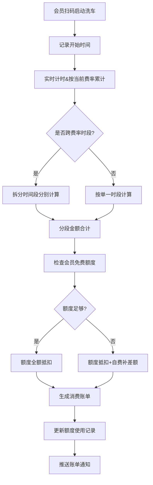

## 1. 产品概述
自助洗车场会员管理系统，为车主会员提供智能化洗车服务计费与额度管理，解决按时段差异化定价、会员额度管控、消费透明化等核心问题。
- 主要面向自助洗车场的注册会员用户，提供便捷的洗车消费、账单查询、额度管理服务
- 核心价值：精准计费、透明消费、智能额度管理、提升会员粘性

## 2. 核心功能

### 2.1 用户角色
| 角色 | 注册方式 | 核心权限 |
|------|----------|----------|
| 会员用户 | 手机号注册登录 | 洗车消费、账单查询、额度查看、次卡管理 |
| 系统管理员 | 后台账号登录 | 费率配置、额度规则设置、数据统计 |

### 2.2 功能模块
1. **首页**：会员信息概览、当前额度、快捷消费入口、最近消费记录
2. **洗车消费**：开始/结束洗车、实时计费显示、跨档分段计算、费用确认
3. **消费明细**：历史账单列表、账单详情、筛选查询
4. **额度管理**：当前额度查看、额度重置记录、套餐次卡核销、充值记录
5. **费率查询**：时段费率表、计费规则说明

### 2.3 页面详情
| 页面名称 | 模块名称 | 功能描述 |
|---------|----------|----------|
| 首页 | 会员信息卡片 | 显示会员等级、剩余免费额度、次卡数量 |
| 首页 | 快捷操作区 | 开始洗车、消费明细、我的套餐入口 |
| 首页 | 最近消费 | 展示最近3条消费记录 |
| 洗车消费 | 计时计费 | 实时显示洗车时长、当前时段费率、累计费用 |
| 洗车消费 | 费用明细 | 分段展示各时段时长、单价、金额，合计总费用 |
| 洗车消费 | 支付确认 | 显示额度抵扣金额、自费金额、支付方式选择 |
| 消费明细 | 账单列表 | 按月筛选、账单状态、金额、时间 |
| 消费明细 | 账单详情 | 分段计费明细、额度使用明细、支付信息 |
| 额度管理 | 额度概览 | 本月免费额度、已用额度、剩余额度、重置时间 |
| 额度管理 | 次卡管理 | 套餐次卡列表、核销记录、有效期 |
| 费率查询 | 费率表 | 时段划分、对应费率、计费规则说明 |

## 3. 核心流程
车主会员启动洗车→系统识别进场时间→按实时时段费率开始计费→跨费率切换点自动分段计算→洗车结束生成分段明细→优先使用免费额度抵扣→超额部分转为自费→生成完整账单→更新额度使用记录

## 4. 用户界面设计

### 4.1 设计风格
- **主色调**：科技蓝 (#0EA5E9)，代表智能、清洁、专业
- **辅助色**：活力橙 (#F97316)，用于高亮按钮、优惠信息
- **成功色**：翡翠绿 (#10B981)，用于额度充足、支付成功
- **警告色**：琥珀黄 (#F59E0B)，用于额度不足提醒
- **中性色**：深灰 (#1F2937)、中灰 (#6B7280)、浅灰 (#F3F4F6)
- **按钮风格**：圆角8px，带微妙阴影，hover状态有轻微上浮动效
- **字体**：Noto Sans SC 中文显示字体 + JetBrains Mono 数字等宽字体
- **布局风格**：卡片式布局，清晰的信息层级，充足留白
- **图标风格**：线性图标，统一2px描边，圆润端点

### 4.2 页面设计概述
| 页面名称 | 模块名称 | UI Elements |
|---------|----------|-------------|
| 首页 | 会员信息卡片 | 渐变背景卡片、圆形头像、等级徽章、额度进度条 |
| 首页 | 快捷操作区 | 图标+文字网格布局，彩色图标背景 |
| 首页 | 最近消费 | 时间线布局，消费类型标签，金额高亮 |
| 洗车消费 | 计时显示 | 大字号等宽数字，实时跳动动效 |
| 洗车消费 | 费用明细 | 分段列表，时段标签，单价/时长/金额三列对齐 |
| 洗车消费 | 支付确认 | 费用汇总卡片，抵扣项标绿，应付金额加粗放大 |
| 消费明细 | 账单列表 | 月份选择器，账单卡片，状态标签，左右对齐布局 |
| 额度管理 | 额度概览 | 环形进度图，额度数值，重置倒计时 |
| 额度管理 | 次卡管理 | 卡片列表，次卡类型标签，核销按钮，有效期提醒 |
| 费率查询 | 费率表 | 时间轴布局，时段色块，费率高亮显示 |

### 4.3 响应性
- 桌面端优先设计，1200px以上最佳展示
- 平板端：1024px-1199px，保持双列布局，适当缩小间距
- 移动端：768px-1023px，转为单列布局，底部导航栏
- 小屏：767px以下，优化触控区域，最小44px点击目标

### 4.4 动效设计
- 页面加载：元素从下往上淡入，错落100ms延迟
- 数字变化：金额、时长使用平滑数字滚动动画
- 卡片hover：轻微上浮(translateY(-2px))，阴影加深
- 按钮交互：点击时缩放至96%，释放回弹
- 进度条：额度进度条使用渐变填充动画
- 模态框：背景模糊+缩放进入动效
