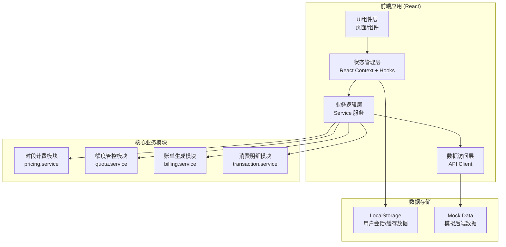
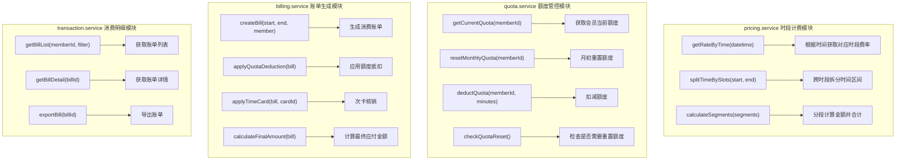
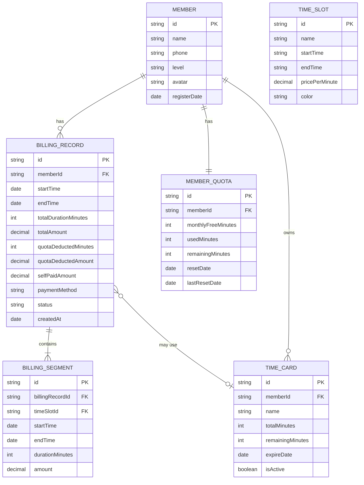

## 1. 架构设计



## 2. 技术描述
- **前端框架**：React@18 + TypeScript
- **构建工具**：Vite@5
- **样式方案**：TailwindCSS@3 + CSS变量
- **路由管理**：React Router DOM@6
- **状态管理**：React Context + useReducer
- **图表可视化**：Recharts（用于额度进度、消费统计）
- **图标库**：Lucide React
- **日期处理**：date-fns
- **后端**：无，使用Mock数据模拟
- **数据持久化**：LocalStorage存储用户状态和消费记录

## 3. 路由定义
| Route | 页面 | 用途 |
|-------|------|------|
| / | 首页 | 会员概览、快捷操作、最近消费 |
| /wash | 洗车消费 | 开始/结束洗车、实时计费、费用确认 |
| /transactions | 消费明细 | 账单列表、账单详情 |
| /quota | 额度管理 | 额度概览、次卡管理、重置记录 |
| /pricing | 费率查询 | 时段费率表、计费规则 |

## 4. 核心数据类型定义

```typescript
// 时段费率类型
interface TimeSlot {
  id: string;
  name: string;           // 高峰/平峰/低谷
  startTime: string;      // HH:mm 格式
  endTime: string;        // HH:mm 格式
  pricePerMinute: number; // 每分钟单价(元)
  color: string;          // 展示颜色
}

// 分段计费明细
interface BillingSegment {
  timeSlot: TimeSlot;
  startTime: Date;
  endTime: Date;
  durationMinutes: number;
  amount: number;
}

// 会员额度类型
interface MemberQuota {
  memberId: string;
  monthlyFreeMinutes: number;   // 每月免费额度(分钟)
  usedMinutes: number;          // 已使用分钟
  remainingMinutes: number;     // 剩余分钟
  resetDate: Date;              // 下次重置日期
  lastResetDate: Date;          // 上次重置日期
}

// 次卡类型
interface TimeCard {
  id: string;
  name: string;
  totalMinutes: number;
  remainingMinutes: number;
  expireDate: Date;
  isActive: boolean;
}

// 消费账单类型
interface BillingRecord {
  id: string;
  memberId: string;
  startTime: Date;
  endTime: Date;
  totalDurationMinutes: number;
  segments: BillingSegment[];
  totalAmount: number;
  quotaDeductedMinutes: number;  // 额度抵扣分钟
  quotaDeductedAmount: number;   // 额度抵扣金额
  selfPaidAmount: number;        // 自费金额
  timeCardUsed?: {               // 次卡使用(可选)
    cardId: string;
    minutesUsed: number;
  };
  paymentMethod: string;
  status: 'pending' | 'paid' | 'cancelled';
  createdAt: Date;
}

// 会员信息
interface Member {
  id: string;
  name: string;
  phone: string;
  level: 'normal' | 'silver' | 'gold' | 'platinum';
  avatar?: string;
  registerDate: Date;
  quota: MemberQuota;
  timeCards: TimeCard[];
}
```

## 5. 核心业务模块架构



## 6. 数据模型（LocalStorage存储结构）

### 6.1 数据模型定义



### 6.2 初始化数据（Mock）

```typescript
// 时段费率配置表
const defaultTimeSlots: TimeSlot[] = [
  { id: '1', name: '低谷时段', startTime: '00:00', endTime: '07:00', pricePerMinute: 0.30, color: '#60A5FA' },
  { id: '2', name: '平峰时段', startTime: '07:00', endTime: '17:00', pricePerMinute: 0.50, color: '#34D399' },
  { id: '3', name: '高峰时段', startTime: '17:00', endTime: '20:00', pricePerMinute: 0.80, color: '#F97316' },
  { id: '4', name: '夜间平峰', startTime: '20:00', endTime: '24:00', pricePerMinute: 0.40, color: '#A78BFA' },
];

// 测试会员数据
const mockMember: Member = {
  id: 'M001',
  name: '张三',
  phone: '138****8888',
  level: 'gold',
  registerDate: new Date('2024-01-15'),
  quota: {
    memberId: 'M001',
    monthlyFreeMinutes: 120,
    usedMinutes: 45,
    remainingMinutes: 75,
    resetDate: new Date(new Date().getFullYear(), new Date().getMonth() + 1, 1),
    lastResetDate: new Date(new Date().getFullYear(), new Date().getMonth(), 1),
  },
  timeCards: [
    {
      id: 'TC001',
      name: '黄金会员专享次卡',
      totalMinutes: 300,
      remainingMinutes: 180,
      expireDate: new Date('2026-12-31'),
      isActive: true,
    }
  ]
};
```
